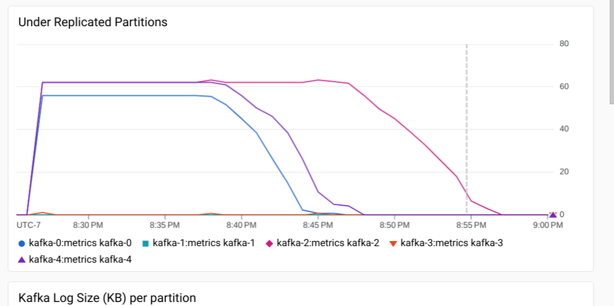
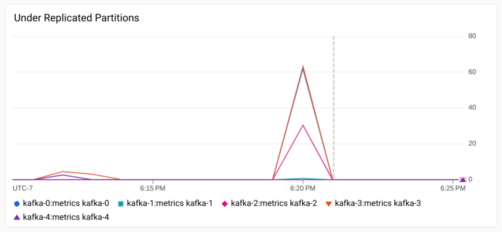

# Stateful HA operator User Guide

This product is covered by the [Pre-GA Offerings Terms](https://cloud.google.com/terms/service-terms#1) of the Google Cloud Terms of Service. Pre-GA products might have limited support, and changes to pre-GA products might not be compatible with other pre-GA versions. For more information, see the [launch stage descriptions](https://cloud.google.com/products#product-launch-stages).

This is an offering shared as “early access”. These features may be unstable, change in backward-incompatible ways, and are not guaranteed to be released. There are no SLAs provided and no technical support obligations. This is intended for use in test environments only. 

## Overview

The HighAvailabilityApplication is a Kubernetes resource that simplifies StatefulSet settings and increases Pod availability on GKE. This guide provides instructions on running and installing a Stateful HA operator that reconciles HighAvailabilityApplication resources on GKE. This package includes a Helm chart that installs the Stateful HA operator.

The Stateful HA operator requires you to use a <code>[regional-pd StorageClass](https://cloud.google.com/kubernetes-engine/docs/how-to/persistent-volumes/regional-pd)</code>. This allows your application’s storage to be replicated at the storage layer, available across two zones.


*   If you run a single replica StatefulSet, Regional PD increases your application’s data durability, and applying a HighAvailabilityApplication resource improves the availability of your application in the event of a node failure.
*   If you run a multi-replica StatefulSet (and your application’s data is already replicated at the application layer), applying a HighAvailabilityApplication resource reduces the amount of time your data is underreplicated in the event of a node or zone failure.


## Configuring the HighAvailabilityApplication Resource

Use the following specification fields to configure settings that apply to your application.


### .spec.resourceSelection

You can select the application to be managed by a HighAvailabilityApplication resource. This is done through the `.spec.resourceSelection` field. The HighAvailabilityApplication resource should be installed in the same namespace as the referenced application. Currently only `resourceKind: StatefulSet` is supported.


### .spec.policy.storageSettings.requireRegionalStorage

This setting validates the `HighAvailabilityApplication` resource to ensure your StatefulSet application is using a regional `StorageClass`. Currently, the Stateful HA operator supports only the use of the HighAvailabilityApplication resource with [Regional Persistent Disk](https://cloud.google.com/kubernetes-engine/docs/how-to/persistent-volumes/regional-pd) storage.


### .spec.policy.failoverSettings

In Kubernetes, a Pod is not deleted automatically when a [node becomes unreachable](https://kubernetes.io/docs/tasks/run-application/force-delete-stateful-set-pod/#force-deletion). When running StatefulSet Pods in a Kubernetes cluster today, it could take 8 minutes or more for your application pods to be deleted and rescheduled to a new node, depending on your cluster’s [Node Repair Strategy](https://cloud.google.com/anthos/clusters/docs/on-prem/latest/how-to/node-auto-repair). A HighAvailabilityApplication resource can be configured to reschedule your Pods after a custom timeout to limit the period of time that a Pod is unavailable.

Setting the `.forceDeleteStrategy: AfterNodeUnreachable` strategy allows the Stateful HA operator to reschedule your StatefulSet pods after a timeout, specified by the `afterNodeUnreachableSeconds` field. Note that it takes ~40 seconds for a node to be marked as unreachable, so when a node first fails to succeed a health check, your application’s Pods will be unavailable for a minimum of 40 seconds. The `afterNodeUnreachableSeconds` is the amount of time the Stateful HA operator waits after a node is marked as unreachable.

### Resources

*   [Demo Video](https://www.youtube.com/watch?v=yVc0Hs7Bu6w)


## Installing the operator

The operator runs as a Deployment in your cluster. To install the operator and `HighAvailabilityApplication` custom resource definition, run the following commands:

```
VERSION=0.1.5
REPO="gke-release"
mkdir /tmp/ha-operator
cd /tmp/ha-operator
gsutil cp gs://$REPO/ha-controller/$VERSION/ha-controller-helm.tar.gz .
tar xvf ha-controller-helm.tar.gz
helm upgrade -i ha-operator helm-chart \
  --namespace ha-operator \
  --create-namespace \
  --set image.repository="$REPO" \
  --set image.tag="$VERSION" \
  --set useWorkloadSeparation=true \
  --set workloadSeparationGroupName=ha-operator
```

Note: The operator uses [Workload Separation](https://cloud.google.com/kubernetes-engine/docs/how-to/workload-separation), with <code>[group: ha-operator](http://ha.gke.io/ha-controller)</code> by default. To install on any available node in your cluster, set `useWorkloadSeparation=false`.


### Applying the resource to an existing StatefulSet

Apply the following YAML definition of a `HighAvailabilityApplication` resource to an existing workload (eg: `my-namespace/my-app`).

Note: Setting `.spec.policy.storageSettings.requireRegionalStorage` will check that the existing StatefulSet is using regional storage.

```
kind: HighAvailabilityApplication
apiVersion: ha.gke.io/v1alpha1
metadata:
  name: my-app
  namespace: my-namespace
spec:
  resourceSelection:
    type: "ApplicationName"
    resourceKind: StatefulSet
    applicationName: postgresql
  policy:
    storageSettings:
      requireRegionalStorage: true
    failoverSettings:
      forceDeleteStrategy: AfterNodeUnreachable
      afterNodeUnreachable:
        afterNodeUnreachableSeconds: 20 # 60 seconds total
```

## FAQ

**What Stateful Application can benefit from this feature?**

Single-replica Applications: The cost to onboard to or re-architect single-replica applications can be very high. The Stateful HA operator gives you the controls to swap out zonal storage for regional storage, to reduce the risk of unavailability in the event of a zone failure.

Static replica Applications: For N+k architectures that don’t support horizontal autoscaling, replicas are often provisioned with some capacity overhead, to allow for other replicas to share load in the event of a failure. This reserve capacity can result in reduced efficiency for your application. By using the Stateful HA operator, you can reduce the amount of time that your application will be unable to reschedule its replicas, allowing your application to maintain full availability.

High throughput multi-replica Applications: Some multi-replica applications (such as Kafka) have high throughput replication requirements. When running replicas across multiple zones, the cross-zone networking costs to replicate data at the application layer can outweigh the storage costs significantly. By using Regional Persistent Disk and moving your application replicas into a single zone with the Stateful HA operator, you can shed the cross-zone traffic costs, and still benefit from automatic failover to an alternate zone in event of a zone failure.


## Appendix


### PostgreSQL Demo

In this example we show how the HighAvailabilityController improves the availability of single replica PostgreSQL instance protected with a `HighAvailabilityApplication` resource. A zone failure is simulated by disrupting the node the PostgreSQL replica is running on. The Stateful HA operator detects the failure, and reschedules the pod from the failed node to a different node in an alternate zone. This is possible as the application is using a Regional Persistent Disk, which is available from two different zones.


1. Create a cluster

    a. GKE Standard
 
    This creates a dedicated nodepool for the operator, using [Workload Separation](https://cloud.google.com/kubernetes-engine/docs/how-to/workload-separation)

    ```
    gcloud container clusters create ha-demo --num-nodes=1 --region=us-west1

    gcloud container node-pools create ha-operator --cluster ha-demo --node-locations us-west1-a --num-nodes=1 --node-taints group=ha-operator:NoSchedule --node-labels group=ha-operator
    ```

    b. GKE Autopilot

    ```
    gcloud container clusters create-auto ha-demo-autopilot --region us-west1
    ```

2. Install the operator

```
VERSION=0.1.5
REPO="gke-release"
mkdir /tmp/ha-operator
cd /tmp/ha-operator
gsutil cp gs://$REPO/ha-controller/$VERSION/ha-controller-helm.tar.gz .
tar xvf ha-controller-helm.tar.gz
helm upgrade -i ha-operator helm-chart \
  --namespace ha-operator \
  --create-namespace \
  --set image.repository="$REPO" \
  --set image.tag="$VERSION" \
  --set useWorkloadSeparation=true
```

3. Wait for the operator to become ready

Note: On Autopilot this will take 2-3 minutes for GKE to create a new dedicated node for the operator.

```
kubectl get pod --namespace ha-operator --watch
```

4. Create the namespaces

```
kubectl create ns postgresql
kubectl config set-context --current --namespace postgresql
```

5. Install a StorageClass

```
cat <<EOF | kubectl apply -f -
apiVersion: storage.k8s.io/v1
kind: StorageClass
metadata:
  name: ha-regional
parameters:
  replication-type: regional-pd
  type: pd-ssd
  availability-class: regional-hard-failover
provisioner: pd.csi.storage.gke.io
reclaimPolicy: Delete
volumeBindingMode: WaitForFirstConsumer
allowedTopologies:
- matchLabelExpressions:
  - key: topology.gke.io/zone
    values:
    - us-west1-a
    - us-west1-b
EOF
```

6. Install a PostgreSQL StatefulSet

```
helm install postgresql oci://registry-1.docker.io/bitnamicharts/postgresql --set global.storageClass=ha-regional
```

7. Wait for the PostgreSQL replica to become ready

```
kubectl get pod postgresql-0 --watch
```

8. Run the following command to install a `HighAvailabilityApplication` resource.

```
cat <<EOF | kubectl apply -f -
kind: HighAvailabilityApplication
apiVersion: ha.gke.io/v1alpha1
metadata:
  name: postgresql-ha-app
  namespace: postgresql
spec:
  resourceSelection:
    type: "Selector"
    resourceKind: StatefulSet
    selector:
      matchLabels:
        app.kubernetes.io/name: postgresql
  policy:
    storageSettings:
      requireRegionalStorage: true
    failoverSettings:
      forceDeleteStrategy: AfterNodeUnreachable
      afterNodeUnreachable:
        afterNodeUnreachableSeconds: 20 # 60 seconds total
EOF
```

9. Run the `describe` command on  the `HighAvailabilityApplication` resource to see that the application is protected

```
kubectl describe highavailabilityapplication postgresql-ha-app

Status:
  Conditions:
    Last Transition Time:  2023-08-09T23:59:52Z
    Message:               Application is protected
    Observed Generation:   1
    Reason:                ApplicationProtected
    Status:                True
    Type:                  Protected
Events:
  Type    Reason                      Age   From           Message
  ----    ------                      ----  ----           -------
  Normal  PodTolerationUpdatePending  49s   ha-controller  Updating tolerations for 1 pods
  Normal  PodUpdateToleration         49s   ha-controller  Update node.kubernetes.io/unreachable toleration for pod postgresql-0 successful
```

10. Cordon all nodes in the replica's zone and simulate zone failure

```
POD=postgresql-0
NODE="$(kubectl get pod $POD  -o=jsonpath='{.spec.nodeName}')"
ZONE="$(kubectl get node $NODE -o=jsonpath='{.metadata.labels.topology\.kubernetes\.io/zone}')"
MIG=$(gcloud compute instances describe $NODE --format="value(metadata.created-by)" --zone $ZONE)
MIG_SIZE=$(gcloud compute instance-groups describe $(echo $MIG | cut -d'/' -f6-) --zone=$ZONE --format="value(size)")
gcloud compute instance-groups managed abandon-instances $MIG \
  --instances=$NODE --zone=$ZONE
gcloud compute instances suspend $NODE --zone $ZONE
```

11. Watch the pod be rescheduled 20 seconds after the node is marked as unreachable

```
kubectl get pod postgresql-0 -o wide --watch

NAME           READY   STATUS    RESTARTS   AGE
postgresql-0   1/1     Running   0          26m
postgresql-0   1/1     Running   0          27m
postgresql-0   1/1     Terminating   0          27m
postgresql-0   1/1     Terminating   0          27m
postgresql-0   1/1     Terminating   0          27m
postgresql-0   0/1     Pending       0          0s
postgresql-0   0/1     Pending       0          0s
postgresql-0   0/1     ContainerCreating   0          0s
postgresql-0   0/1     ContainerCreating   0          1s
postgresql-0   0/1     Running             0          19s
postgresql-0   1/1     Running             0          31s
```

  *   Starting up on a new node requires force-attach which is done automatically due to the `availability-class` parameter in the storage class.

12. Describe the events on the `HighAvailabilityApplication` resource. This timing will correspond with the Pod being terminated and rescheduled to a new node.

```
kubectl describe highavailabilityapplication postgresql-ha-app

Events:
  Type     Reason                           Age                  From           Message
  ----     ------                           ----                 ----           -------
  Normal   PodFailoverAfterNodeUnreachable  24s                  ha-controller  Triggering failover for pod postgresql-0
  Normal   PodUpdateToleration              23s (x2 over 2m41s)  ha-controller  Update node.kubernetes.io/unreachable toleration for pod postgresql-0 successful
  Normal   PodFailoverAfterNodeUnreachable  23s                  ha-controller  Failover for pod postgresql-0 successful
```

13. Cleanup: Resize the MIG back, and clean up the abandoned instance

```
# NODE should the node that was removed from the MIG in (8) above
ZONE="$(kubectl get node $NODE -o=jsonpath='{.metadata.labels.topology\.kubernetes\.io/zone}')"
MIG=$(gcloud compute instances describe $NODE --format="value(metadata.created-by)" --zone $ZONE)
MIG_SIZE=$(gcloud compute instance-groups describe $(echo $MIG | cut -d'/' -f6-) --zone=$ZONE --format="value(size)")
gcloud compute instance-groups managed resize $MIG \
    --size $(expr $MIG_SIZE + 1) \
    --zone $ZONE
gcloud compute instances delete $NODE --zone $ZONE
```

14. Cleanup: Delete the PostgreSQL installation

```
helm delete postgresql --namespace postgresql
```

15. Cleanup: Delete the Stateful HA operator

```
helm delete ha-operator --namespace ha-operator
```

### Kafka Replicated Failover

In this example we show how the HighAvailabilityController with RePD  redyces the time required to bring a Kafka cluster up to full replication after a zonal outage.


#### Create a GKE Cluster

Follow the instructions in [Deploy a highly-available Kafka cluster on GKE | Kubernetes Engine | Google Cloud](https://cloud.google.com/kubernetes-engine/docs/tutorials/stateful-workloads/kafka) to create a GKE cluster. The GKE cluster should have the following characteristics:

*   At least 5 nodes
*   e2-standard-8 VM shape (or any shape with at least 4 vcpus).

Note: The following example uses a GKE Standard cluster rather than GKE Autopilot cluster, to simplify simulating zonal failures. With GKE Standard, you cordon particular nodes, which is not possible on GKE Autopilot (it’s possible to drain nodes, but to test an outage, you would want to simulate unavailable compute instances in the existing zone).

Note: You need to enable [managed Prometheus for GKE](https://cloud.google.com/stackdriver/docs/managed-prometheus) and use the Kafka dashboards created in the instructions above to see the performance results described in this guide.

#### Deploying Kafka

1. Create the following storage class.

```
cat <<EOF | kubectl apply -f -
apiVersion: storage.k8s.io/v1
kind: StorageClass
metadata:
  name: premium-rwo-regional
parameters:
  type: pd-ssd
  replication-type: regional-pd
provisioner: pd.csi.storage.gke.io
reclaimPolicy: Delete
volumeBindingMode: WaitForFirstConsumer
EOF
```

2. Install the Kafka Helm chart with additional parameters

The StorageClass from the above step is used in the Kafka chart. The number of replicas is increased to 5, which allows the Kafka cluster to achieve utilization similar to production workload.

```
helm install kafka oci://registry-1.docker.io/bitnamicharts/kafka \
  --set global.storageClass=premium-rwo-regional \
  --set controller.replicaCount=5 \
  --metrics.kafka.enabled=true
```

2. Install the HighAvailabiltyApplication custom resource definition.

```
cat <<EOF | kubectl apply -f -
kind: HighAvailabilityApplication
apiVersion: ha.gke.io/v1alpha1
metadata:
  name: kafka-ha-app
  namespace: kafka
spec:
  resourceSelection:
    type: "Selector"
    resourceKind: StatefulSet
    selector:
      matchLabels:
        app.kubernetes.io/name: kafka
  policy:
    storageSettings:
      requireRegionalStorage: true
    failoverSettings:
      forceDeleteStrategy: AfterNodeUnreachable
      afterNodeUnreachable:
        afterNodeUnreachableSeconds: 20 # 60 seconds total
EOF
```

#### Performance Testing

The following commands use the producer performance test with Kafka ([org.apache.kafka.tools.ProducerPerformance](https://github.com/apache/kafka/blob/trunk/tools/src/main/java/org/apache/kafka/tools/ProducerPerformance.java)). The consumer test can also be used in parallel, but the producer test alone can generate sufficient load on the Kafka brokers to result in under-replicated partitions in the event of a node failure.

To focus on the advantages of Regional Persistent Disk, a full zone failure is not simulated. The commands below will cordon all nodes in a zone and then delete a broker Pod. This causes the broker to reschedule in a different zone. When using a zonal disk, you must delete the PVC as well, or the Pod will not be able to schedule as it will be pinned to the failed zone (this is another advantage with using Regional Persistent Disk).

In order to load a 5-broker cluster, use the producer performance test with 8 topics and each producer having uniform random throughput between 10k to 500k records per second. To run this, you must spin  up producer test Pods on the cluster:

```
for ((i=0;i<8;i++)); do
  j=$(printf %03d $i)
  let throughput="10000+($RANDOM*490000)/32767"
  kubectl delete pod client -n kafka
  kubectl run client -n kafka --rm -ti \
    --image bitnami/kafka:3.3.2 -- \
       kafka-topics.sh \
         --create \
         --topic test-$j \
         --partitions 3  \
         --replication-factor 3 \
         --bootstrap-server kafka-headless.kafka.svc.cluster.local:9092
   kubectl run producer-$j -n kafka \
       --image bitnami/kafka:3.3.2 \
       --requests cpu=3.5 --restart=Always -- \
   kafka-run-class.sh org.apache.kafka.tools.ProducerPerformance --topic test-$j --num-records  50000000 --record-size 100 --producer-props acks=1 bootstrap.servers=kafka-headless.kafka.svc.cluster.local:9092 buffer.memory=67108864 batch.size=8196 --throughput $throughput
done
```

#### Results

You can observe the metrics for under replicated partitions after cordoning and deleting a broker, using the “[Under Replication Partitions](https://cloud.google.com/kubernetes-engine/docs/tutorials/stateful-workloads/kafka#monitor)” dashboard, installed as part of the [Deploy a highly-available Kafka cluster on GKE](https://cloud.google.com/kubernetes-engine/docs/tutorials/stateful-workloads/kafka) guide.

A zone can be cordoned with the following command (with `${ZONE}` set according to your cluster, e.g. `us-central1-f`):


```
kubectl cordon -l topology.kubernetes.io/zone=${ZONE}
```


In a zonal cluster, first delete a PVC, then the broker:


```
kubectl delete pvc -n kafka data-kafka-0 --wait=false
kubectl delete pod -n kafka kafka-0
```


In a regional cluster with RePD, only the Pod is deleted, but not the PVC, so that the volume can be used in  the new zone.

Using a zonal disk, the recovery takes on average 32 minutes.



With Regional Persistent Disk, the recovery time should be around 2 minutes.



(The regional disk test was started at 6:18. The blip before 6:15 was recovery while configuring the performance test.)
